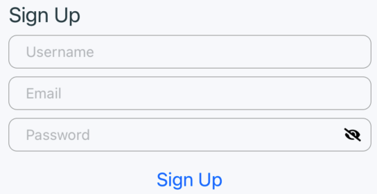

# Авторизация  

> Исходный код: `ui/root/authflow/index.js`  

Включает в себя окна `авторизации`, `регистрации`, `пин-кода`

## Авторизация

> Исходный код: `ui/root/authflow/loginPage.js`  

## Регистрация

> Исходный код: `ui/root/authflow/signUpPage.js`  

## Пин-код

> Исходный код: `ui/root/authflow/PinScreen.js`  

