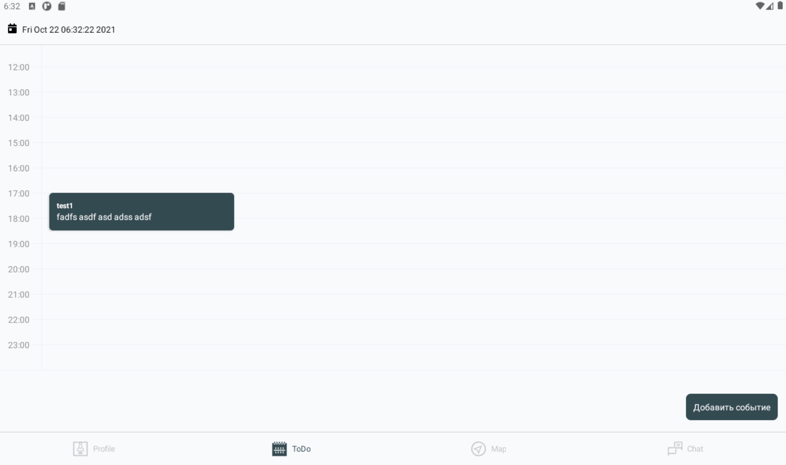

# Планировщик задач  

> Исходный код: `ui/root/calendar/todo.js`  

Включает в себя окна `авторизации`, `регистрации`, `пин-кода`

## Отображение дня
 
> Исходный код: `ui/root/authflow/RenderItemDay.js`  

