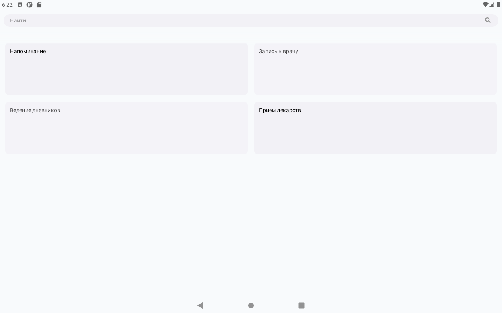

# Планировщик задач  

> Исходный код: `ui/root/calendar/todo.js`  

Включает в себя окна `авторизации`, `регистрации`, `пин-кода`

## Отображение дня
 
> Исходный код: `ui/root/authflow/RenderItemDay.js`  

## Конструктор событий

> Исходный код: `ui/root/authflow/CreateEvent.js`  

<!-- <h3 align="center">Выбор типа событий</h3>   -->

* ### Выбор типа событий

  

<!-- <h3 align="center">Конструктор событий</h3>   -->

* ### Конструктор событий

### Выбор времени

> Исходный код: `ui/root/authflow/TimeSchedule.js` 

Представляет список выбраных времён. Возвращает список массив времён в строковом формате.

### Выбор дня недели

> Исходный код: `ui/root/authflow/WeekSchedule.js` 

Представляет список дней недели. Возвращает список выбраных индексов.

