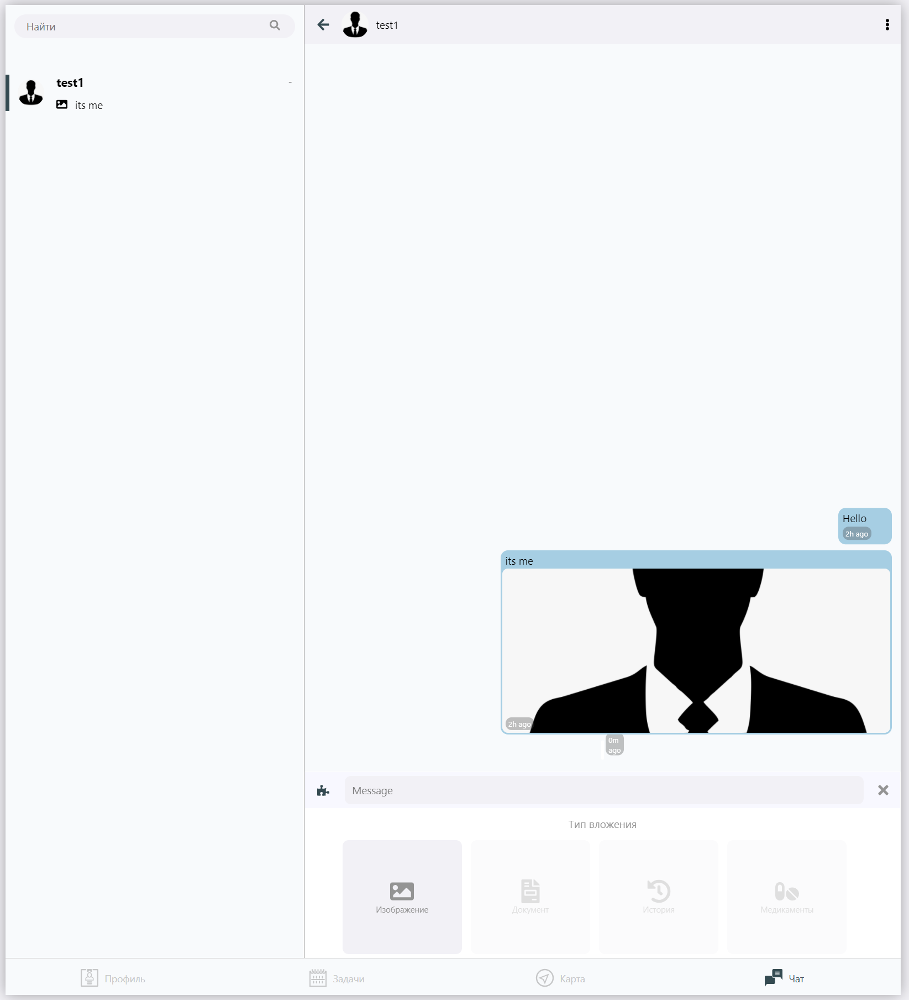

# Чат
> Исходный код: `ui/root/chats/chats.js`  

Включает в себя окна `список друзей`, `окно переписки`

Шапка чата отображает информацию о собеседнике (ФИО или username), кнопки навигации.

## Список друзей

Инициализируется в `chats.js`  

### Элемент списка друзей

> Код элемента списка: `ui/root/chats/ChatItem.tsx`  

Принимает информацию о пользователе и рисует её на карточке.  
Используемые поля: 
1. `avatar`
2. `username`
3. `personal`  
3.1. `FirstName`  
3.2. `MiddleName`  
3.3. `LastName`  
4. `chat`  
4.1. `messages`  

## Окно переписки

> Исходный код: `ui/root/chats/chatView`  

Содержит шапку чата и список сообщений.  
Список формируется из элементов сообщений.  
Шапка содержит информацию о собеседнике (аватар, имя, кнопка настроек чата)  

### Элемент сообщения

> Исходный код: `ui/root/chats/MessageView.js`  

Отрисовывает "облачко" сообщения с текстом и вложением в нём.

### Меню вложений

> Исходный код: `ui/components/messageKeyboard`  

Располагается под полем для ввода текста сообщения.  
Состоит из плиток вложений, каждая из которых вызывает собственное меню выбора.
