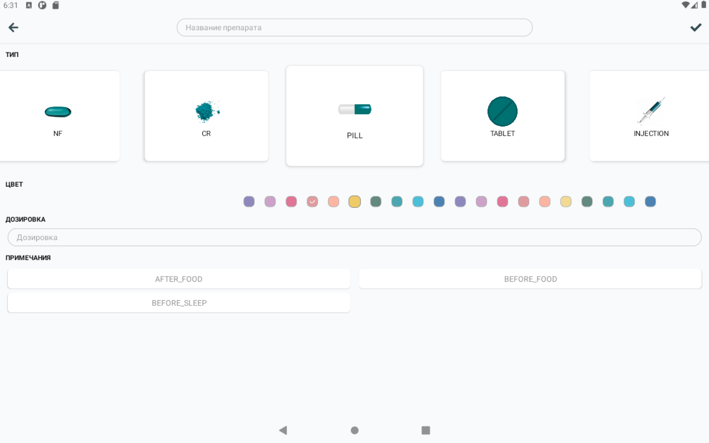
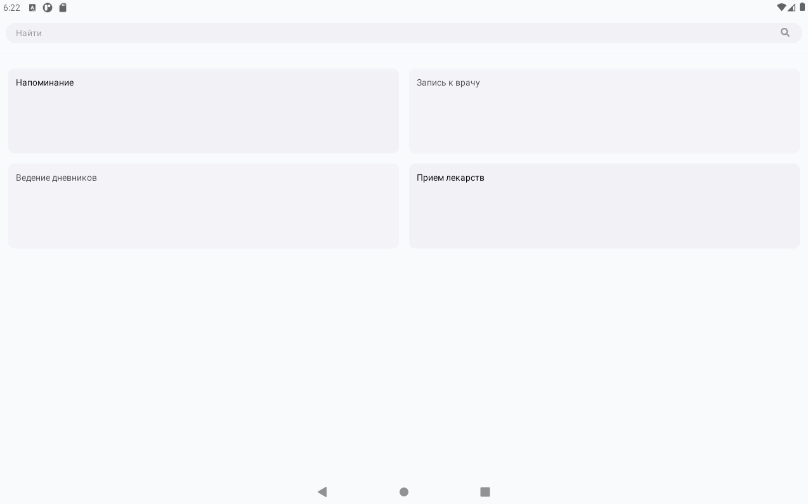
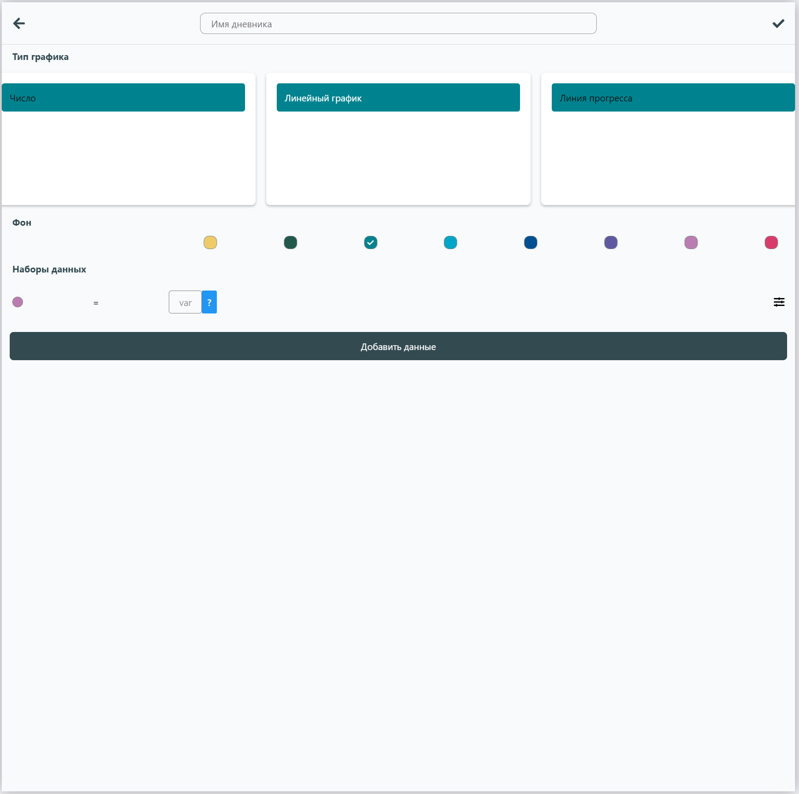

# Конструкторы

:::info

В этом разделе описаны все имеющиеся конструкторы.  
Если в других разделах используются конструкторы, они ссылаются на эту страницу.  
:::

## Конструктор медикаментов

> Исходный код: `ui/root/diary/AddDiaryItem.js` 

При создании медикамента необходимо задать следующие параметры:
1. Название 
2. Тип (форма препарата)
3. Цвет 
4. Дозировка
5. Примечания
   

## Конструктор переменных

> Исходный код: `ui/root/diary/AddDiaryItem.js` 

При создании переменной необходимо указать следующие параметры:  
1. Название переменной
2. Цвет иконки
3. Допустимые пределы (мин/макс)  
   

## Конструктор событий

> Исходный код: `ui/root/calendar/CreateEvent.js`  

При создании нового события необходимо указать следующие параметры:
1. Тип события
2. Название
3. Периодичность (дата или дни недели)
4. Время (массив значений)
5. Режим уведомлений
6. Описание события для отображения на планировщике

### Выбор типа события

  

### Параметры события

#### Выбор времени

> Исходный код: `ui/root/authflow/TimeSchedule.js` 

Представляет список выбраных времён. Возвращает список массив времён в строковом формате.

#### Выбор дня недели

> Исходный код: `ui/root/authflow/WeekSchedule.js` 

Представляет список дней недели. Возвращает список выбраных индексов.

## Конструктор дневников

> Исходный код: `ui/root/diary/AddDiaryItem.js` 

При создании дневника необходимо задать следующие параметры:
1. Название дневника
2. Тип графика
3. Цвет фона
4. Набор данных
   
**Набор данных** представляет список выражений, каждое из которых отражает отношение совокупности переменных.
> Например: баланс жидкости = разность залитой и вылитой жидкости.   
> Эти параметры могут быть отображены в виде:
> * двух линий (два выражения по одной переменной в каждом)
> * одной линии, отражающей их разность (одно выражение типа А - В).

Выражения **собираются** из блоков вида `[var][?]`.   
* По клику на блок `[var]` открывается диалог со списком переменных.  
* По клику на блок `[?]` открывается диалог со список доступных операций.   

Справа от выражения находится кнопка **настроек выражения**, где можно задать такие параметры как:
* Цвет элемента на графике
* Включение выражения в статистику по виджету
* Префикс и суфикс при подсчете статистики

