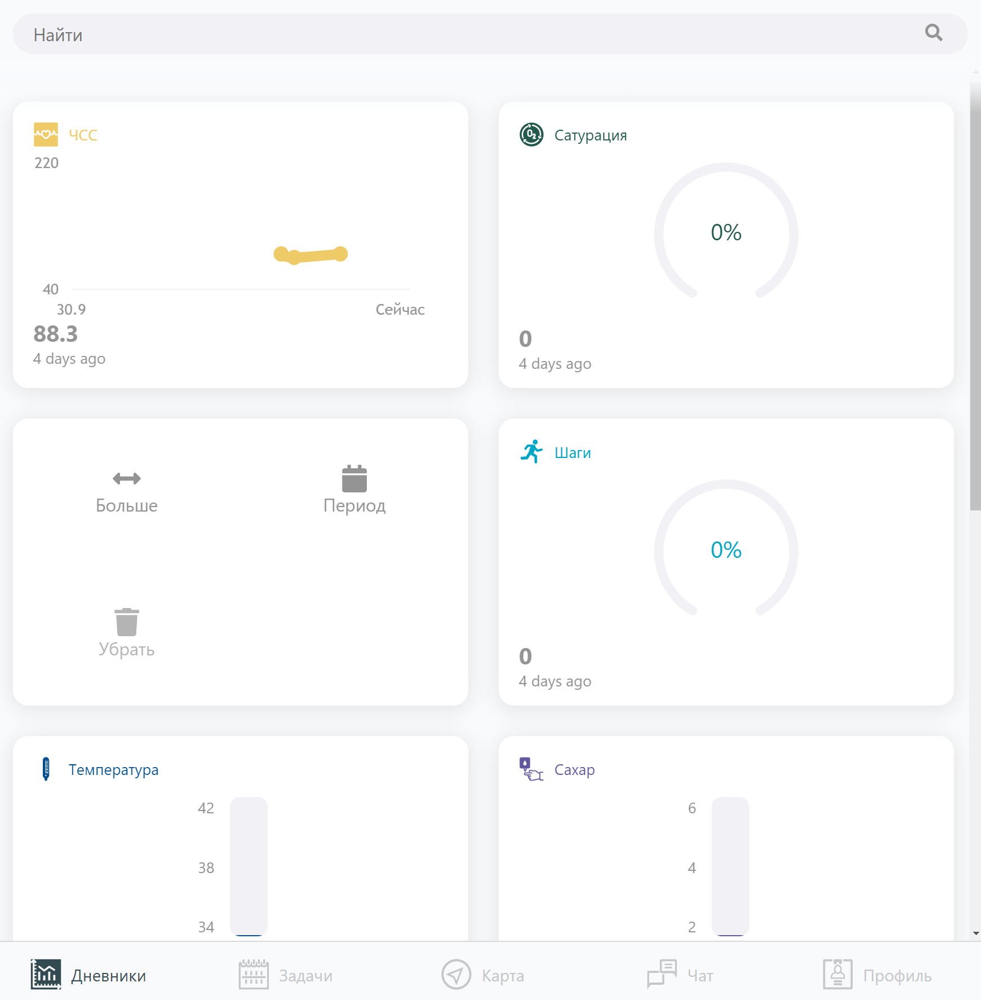

# Дневники

> Исходный код: `ui/root/diary/diary.js`  

* Конструктор дневников описан [здесь](http://localhost:3001/docs/views/constructors#конструктор-дневников)

## Назначение

**Дневники предназначены для мониторинга** изменения совокупности каких-либо переменных. 
При добавлении нового значения на виджет, данные записываются в профиль в БД (history) и график перерисовывается.

При регистрации пользователя, в его профиле создаётся набор **стандартных** дневников:
1. ЧСС
2. Сатурация (насыщенность крови кислородом)
3. Давление
4. Шаги
5. Температура
6. Сахар
7. Вес
8. Рост
9. ИМТ (Индекс массы тела)

Также пользователь может добавить новые виджеты, или удалить существующие.

**Настройки** доступны при длительном нажатии на виджет:
1. Размер:  
1.1. Узкий (половина строки)  
1.2. Широкий (вся строка)  
2. Период агрегации  
2.1. День  
2.2. Неделя  
2.3. Месяц  
3. Удалить виджет

## Демонстрация 

### Панель дневников

<!-- <h4 align="center">Панель дневников</h4> -->

### Просмотр дневника
 

<!-- <h4 align="center">Просмотр дневника</h4> -->

### Добавление значения

<!-- <h4 align="center">Добавление нового значения</h4> -->
