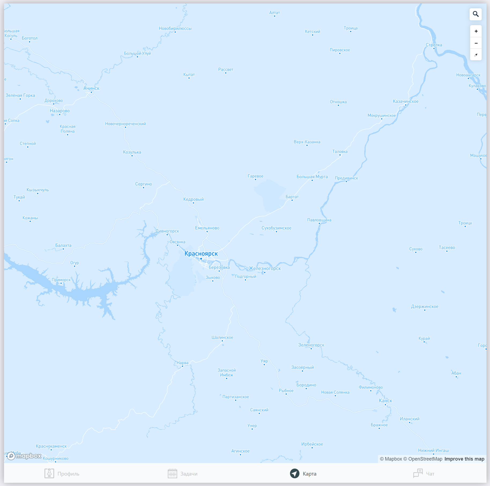

# Карта

> Исходный код: `ui/root/map/index.tsx`  

Карта позволяет пользователю отмечать себя специальной меткой (маркером) на карте, а также видеть метки других пользователей. 

**Список задач:**
- [x] Отображение карты
- [x] Отображение меток
- [ ] Создание метки
- [ ] Построение машрутов (нужны таргет поинты) 

