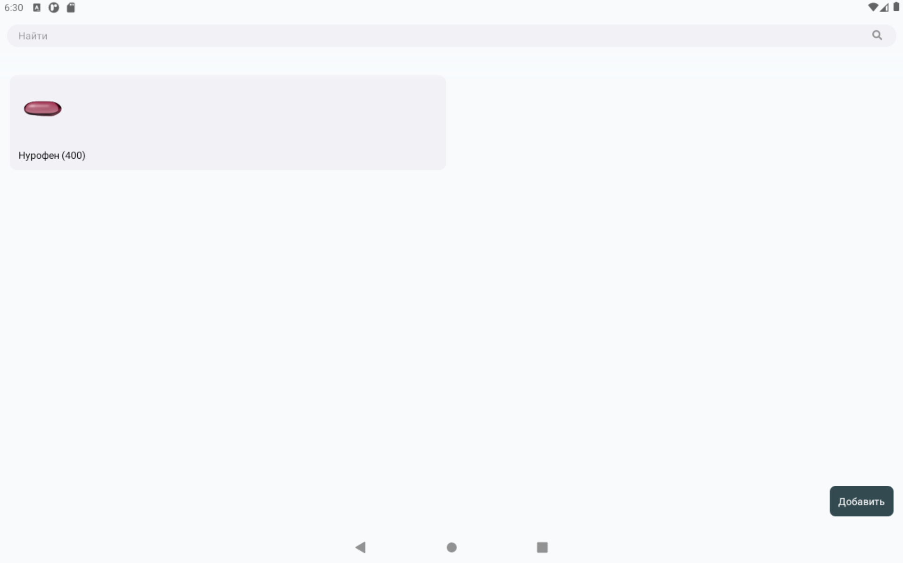

# Медикаменты

> Исходный код: `ui/root/medicaments/MedicamentList.js`  


* Конструктор медикаментов описан [здесь](http://localhost:3001/docs/views/constructors#конструктор-медикаментов)

Медикаменты представлены в виде карточек препаратов с дополнительной информацией, такой как:

- [x] Название
- [x] Форма препарата
- [x] Дозировка
- [x] Примечания

При добавлении нового медикамента, можно выбрать готовую карточку из словаря, или же создать свою. 
При поиске карточек, сначала выдаются имеющиеся у пользователя, затем те, что есть в словаре.




<!-- ```SnackPlayer name=Example description=Description platform="web" title="test title"
import React from 'react';
import { Text, View } from 'react-native';

const YourApp = () => {
  return (
    <View style={{ flex: 1, justifyContent: "center", alignItems: "center" }}>
      <Text>Try editing me! 🎉</Text>
    </View>
  );
}

export default YourApp;
``` -->

<div class="expo">
<iframe src="https://snack.expo.dev/embedded/@n.zaycev/github.com-nzaycev-testproject?iframeId=nj0womgv4l&preview=true&platform=web&theme=light" width="100%" height="500px"></iframe></div>


<div data-snack-id="@n.zaycev/github.com-nzaycev-testproject" data-snack-platform="web" data-snack-preview="true" data-snack-theme="light"></div>
<script src="https://snack.expo.dev/embed.js"></script>
