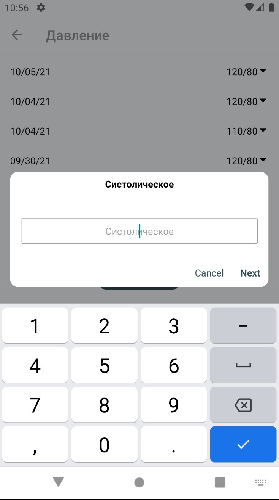
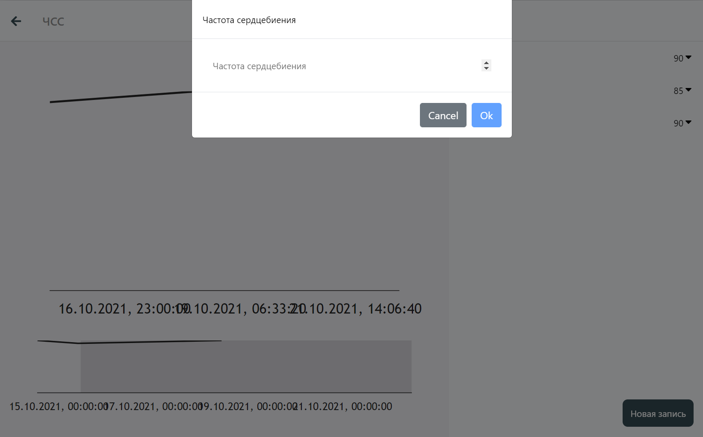

# Редактирование истории

Редактирование истории производится из окна просмотра дневника, попасть в которое можно кликнув по нужному виджету на окне дневников.

## Добавление значения

В окне просмотра дневника, есть возможность добавить данные в историю. При этом, от Вас потребуется ввести те данные, которые прописаны в конфигурации дневника. Добавленные данные будут применены и к другим дневникам, если вышеуказанные имеют пересечения в переменных. То есть, если Вы в разное время укажете свой вес и рост в разных дневниках, в дневнике ИМТ (индекс массы тела) появится значение, основанное на указанных Вами ранее значениях.

### Мобильная версия

### Веб-версия

## Удаление значения

<strong>В разработке</strong>
