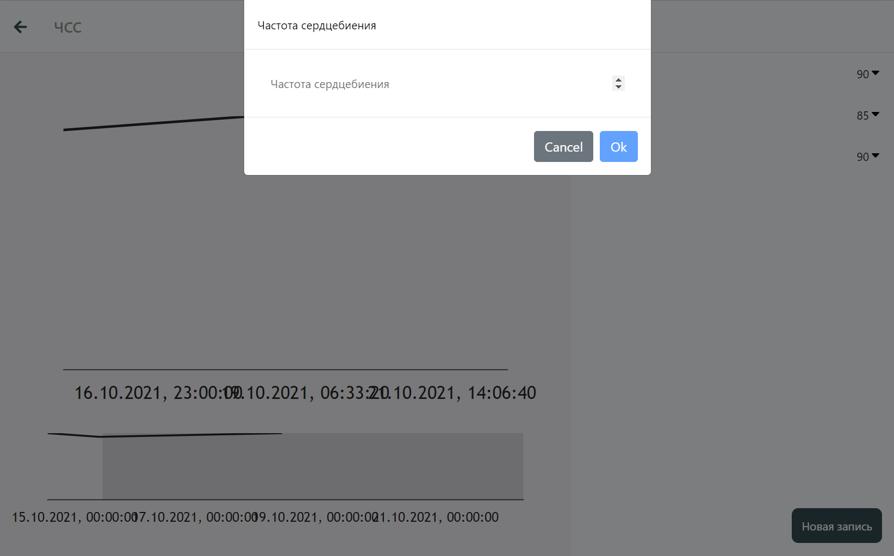

# Введение

В данном разделе описано ведение дневников, рассмотрены следующие темы:
- [ ] Назначение дневников
- [ ] Фукнционал дневников
- [ ] Редактирование дневников

## Дневники

### Назначение дневников
Дневники предназначены для мониторинга состояния каких-либо показателей, называемых `переменные`  (variables).

### Просмотр дневника
 

<!--  -->

### Добавление значения

<!--  -->

## Функционал дневников

## Редактирование дневников

