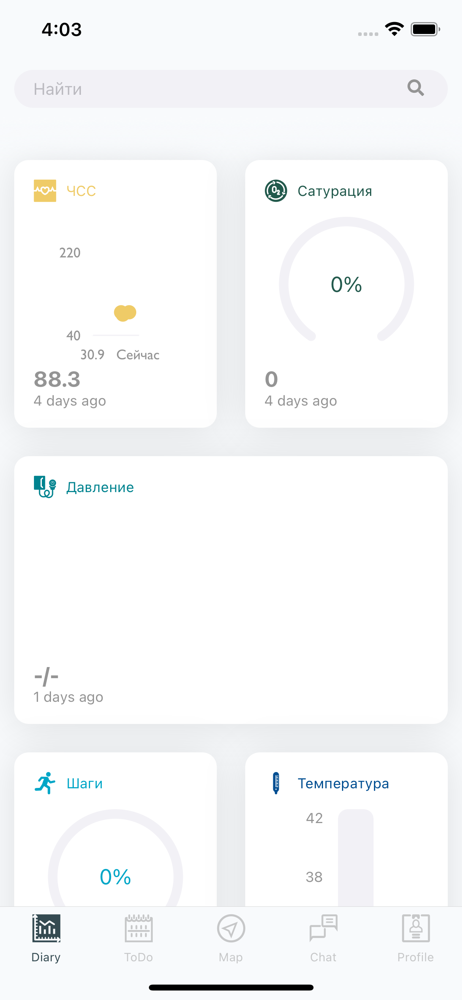

# Введение

В данном разделе описано ведение дневников, рассмотрены следующие темы:
- [ ] Назначение дневников
- [ ] Фукнционал дневников
- [ ] Редактирование дневников

## Дневники

### Назначение дневников
 
Дневники предназначены для мониторинга состояния каких-либо показателей, называемых `переменные`  (variables).  
График может быть в виде:  
`0` - линейный  
`1` - линия прогресса  
`2` - круг прогресса  
`3` - число

<!--  -->

### Просмотр дневника
 

### Добавление значения

Добавить новое значение в дневник можно при 

## Функционал дневников

## Редактирование дневников

