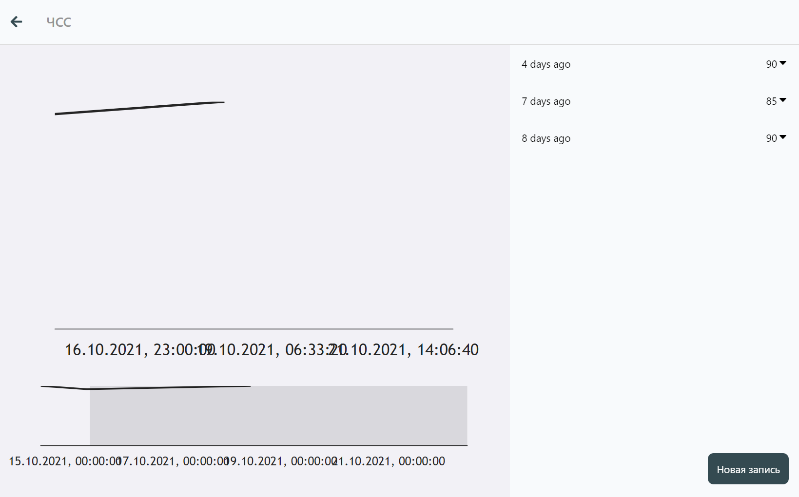
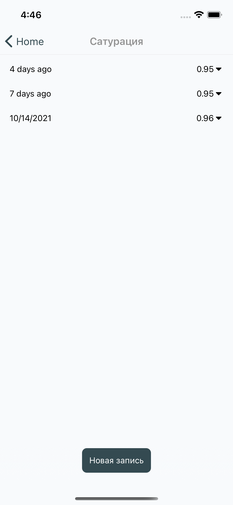

# Введение

В данном разделе описано ведение дневников, рассмотрены следующие темы:
- [ ] Назначение дневников
- [ ] Фукнционал дневников
- [ ] Редактирование дневников

## Дневники

### Назначение дневников
 
Дневники предназначены для мониторинга состояния каких-либо показателей, называемых `переменные`  (variables).  
График может быть в виде:  
`0` - линейный  
`1` - линия прогресса  
`2` - круг прогресса  
`3` - число

<!--  -->

### Просмотр дневника
 
<!--  -->

### Просмотр графика дневника 

График отображает значения переменных, участвующих в конфигурации дневника. Данные не аггрегируются

> В дальнейшем возможно приведение графиков к более опрятному виду и портирование на мобильные версии.

### Добавление значения

В окне просмотра дневника, есть возможность добавить данные в историю. При этом, от Вас потребуется ввести те данные, которые прописаны в конфигурации дневника. Добавленные данные будут применены и к другим дневникам, если вышеуказанные имеют пересечения в переменных. То есть, если Вы в разное время укажете свой вес и рост в разных дневниках, в дневнике ИМТ (индекс массы тела) появится значение, основанное на указанных Вами ранее значениях.

## Функционал дневников

## Редактирование дневников

