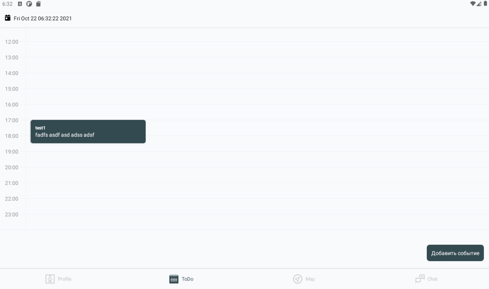
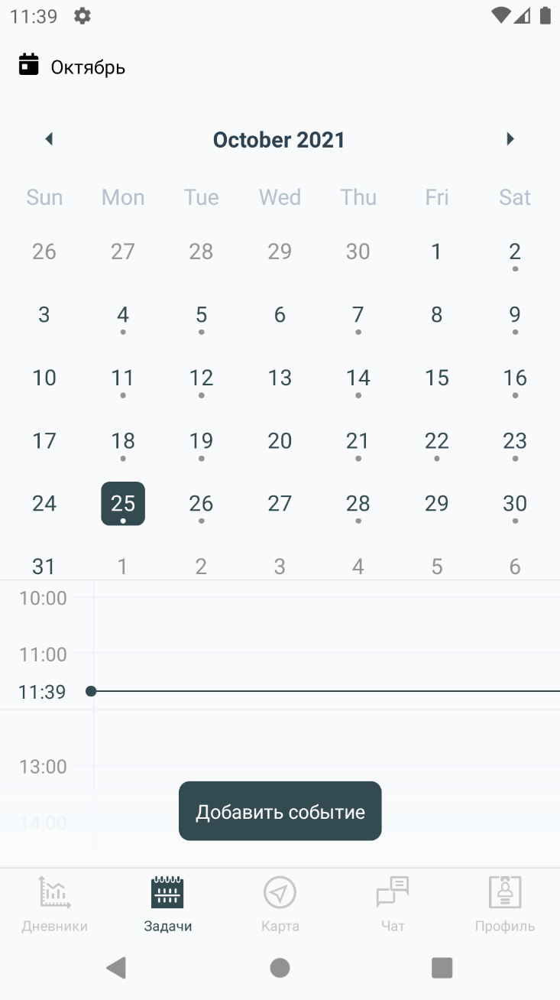
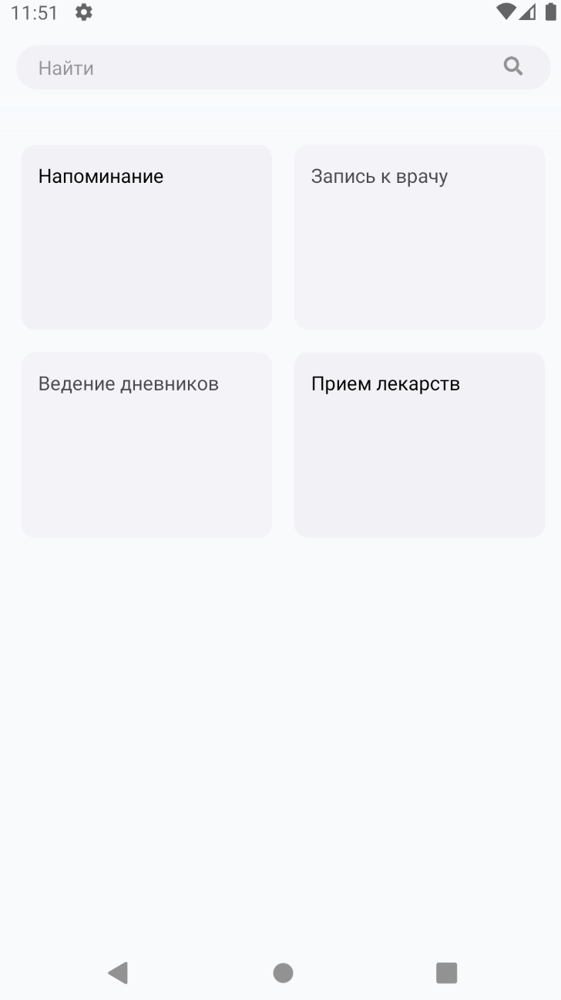
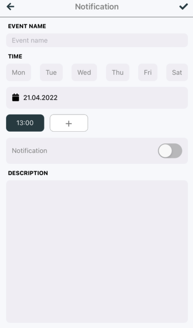
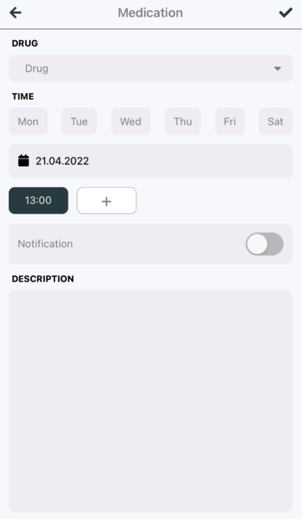
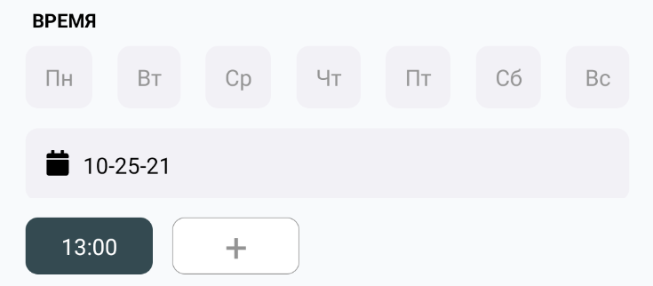

# Планирование

Важным элементом системы является планирование задач. В данном случае задачи подразделяются на

- `напоминания`,
- `прием медикаментов`,
- `запись к врачу` и
- `ведение дневников`
-

## Интерфейс планировщика

Планировщик делится на

- `заголовок` и
- `тело`, разметка которого, в зависимости от ширины экрана, меняется с вертикальной на горизонтальную.

В `теле` содержатся скрываемый блок `календарь` (выбора даты) и блок `расписания на день`. Чтобы раскрыть блок `календарь`, нужно кликнуть по названию месяца в `заголовке`

`Расписание на день` представляет собой некоторого рода дневник, где каждая из 24-х линий отвечает за `час`. Текущее время помечено `primary` цветом и не центрировано по `часу`.

Если на текущий день запланирована какая-либо `задача`, она будет отображена рядом с часом, в который она запланирована. Если у нескольких задач пересекается промежуток выполнения, `задачи` добавляются справа, а поле `Расписание на день` допускает горизонтальный скролл

`Календарь` помечает `pin`-ами те дни, в которые запланирована хотя бы одна задача

    

        
    

    

        
    

## Создание событий

### Общие

Чтобы добавить `Событие`, необходимо кликнуть по соответствующей `кнопке` внизу окна. При широкой разметке, `кнопка` смещается в правый угол.

После нажатия, Вы попадаете в окно выбора `типа события`. На текущий момент доступно только 2 типа:

- `Напоминание`
- `Прием медикаментов`

### Конструктор событий

В зависимости от выбранного `типа события`, открытое далее окно `конструктор событий` будет содержать в себе несколько разный набор компонетов, однако в большинстве случаев эти наборы пересекаются.

    

        
    

    

        
    

### Выбор времени события

Чтобы выбрать время события, можно воспользоваться 2-мя способами:

- выбор даты
- выбор дней недели

В первом случае, вам необходимо выбрать конкретную дату. Тогда `событие` появится в `календаре` только один раз.

Если же Вы решили выбрать дни недели, то `событие` в `календаре` будет появляться постоянно согласно выбранным дням недели. Если в [`конструкторе`](http://localhost:3002/docs/views/constructors#%D0%BA%D0%BE%D0%BD%D1%81%D1%82%D1%80%D1%83%D0%BA%D1%82%D0%BE%D1%80-%D1%81%D0%BE%D0%B1%D1%8B%D1%82%D0%B8%D0%B9) выбран хотя бы один день недели, то виджет `выбор даты` будет неактивен.

После выбора дней, вы можете задать время для появления `события` в `расписании на день`. Для этого на панели с часами Вы можете кликнуть по уже добавленному времени, чтобы его удалить, или по кнопке `+`, чтобы добавить новое время.

