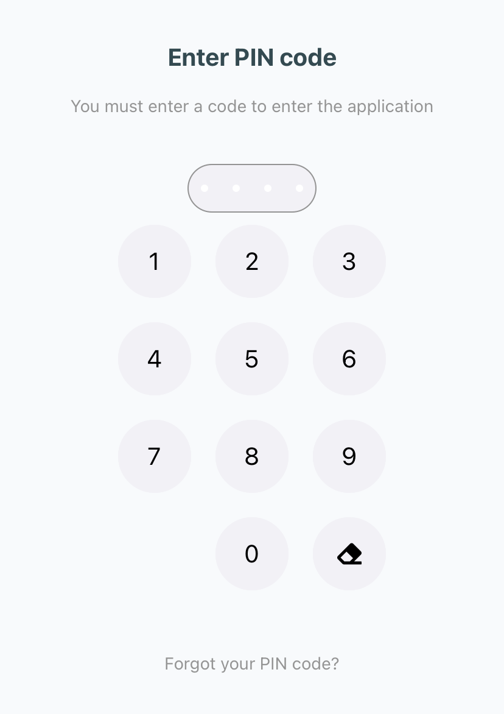

# Безопасность

## Вход

Первый вход в приложение осуществляется через страницу [Login](http://localhost:3002/docs/documentation/server/Routes/auth#login).

<!--  -->

## Регистрация

В текущей версии, [регистрация](http://localhost:3002/docs/documentation/server/Routes/auth#signup) требует только ввода уникального логина и пароля. После регистрации, Вы сразу попадаете в приложение

<!--  -->

## Пинкод  

В мобильных версиях после авторизвации требуется добавить пинкод. Далее, при каждом входе в приложение, необходимо вводить созданный ранее код. Если Вы забыли пинкод, вы можете сбросить данные и зайти заново, нажав на кнопку "Забыли пинкод"

<!--  -->

> - Возможно добавление в Web версию в следующих релизах  
> - Возможно отключение через настройки в следующих релизах  

## Защита

Данные пользователя передаются через протокол HTTPS с SSL шифрованием.

## Patch notes

> Не реализовано:
> - [ ] Вход через Google сервисы
> - [ ] Вход через VK
>
> Features
> - [ ] Настройка входа
> - [ ] Вход по TouchID / FaceID
> - [ ] Интеграция с WEB
> - [ ] Анкета при регистрации