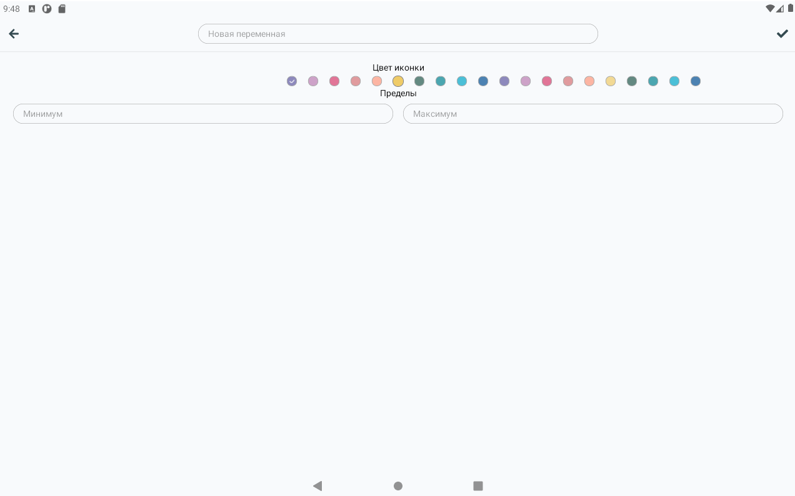
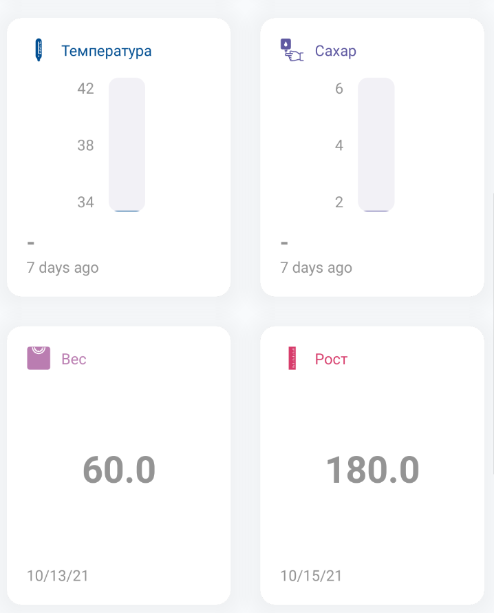
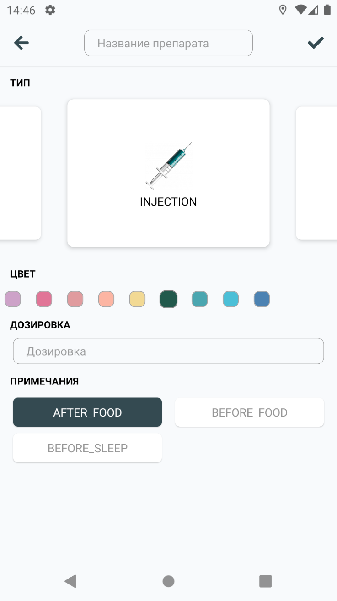

# Сущности

## Переменные

`Переменные` используются для идентификации объектов истории. Конфигурация переменных хранит в себе локализованное имя и верхний и нижний предел. Создание переменных пользователю нужно в крайне редких случаях, однако такую возможность предоставляет `конструктор переменных`.

## Дневники

`Дневники` представляют собой конфигурации, собирающие набор переменных в одном месте, и стилизующие их для удобного представления. Реализованные `типы дневников`:

- [x] Линейные графики
- [x] Прогресс бар (круг)
- [x] Прогресс бар (линия)
- [x] Простое число
- [ ] WaterFall
- [ ] Bar Chart
- [ ] Pie Chart
- [ ] Combine Chart

Некоторые `типы дневников` поддерживают ведение нескольних `наборов данных`. Так, например, линейных график, может нарисовать до трёх линий. В конфигурации дневников доступны:

- Локализованное имя
- Цвет иконки (дневника)
- `Наборы данных`
  - переменные с их операциями,
  - цвет,
  - префикс и суффикс для форматирования,
  - флаг на вывод в итог
- Иконка
- Период (день | неделя | месяц)
- Режим аггрегации (последнее | среднее | сумма)
- Размер (0.5 | 1)
  > В дальнейшем, возможно добавление размеров 0.125, 0.25

Для добавления дневников в профиль, есть 2 способа:

- [x] [`конструктор дневников`](http://localhost:3002/docs/views/constructors#конструктор-дневников)
- [ ] Поиск в базе

Редактирование добавленных дневников доступно через контекстное меню плитки дневника (long press | right mouse click):

- [x] Изменение размера 0.5 | 1
- [x] Изменение периода
- [ ] Удаление
- [ ] Другие настройки:
  - Цвет дневника
  - Иконка лдневника
  - Порядковый номер
  - Цвета ноборов данных
  - Тип дневника

## Медикаменты

`Медикаменты` добавляются в профиль теми же способами, что и `Дневники`. Принципиально, одни от других отличаются только полями в конфигурации. В данном случае, конфигурация включает в себя:

- Тип (форма) препарата
- Цвет препарата
- Дозировка
- Наименование
- Примечания

## Документы

`Документы` должны включать в себя такие поля как:

- [ ] Тип документа
- [ ] Служебные поля (серия, номер, ...)
- [ ] Набор изображений

## Анализы

`Анализы` в данном контексте являются сущностью для хранения конфигураций. История анализов должна храниться в `истории`:
