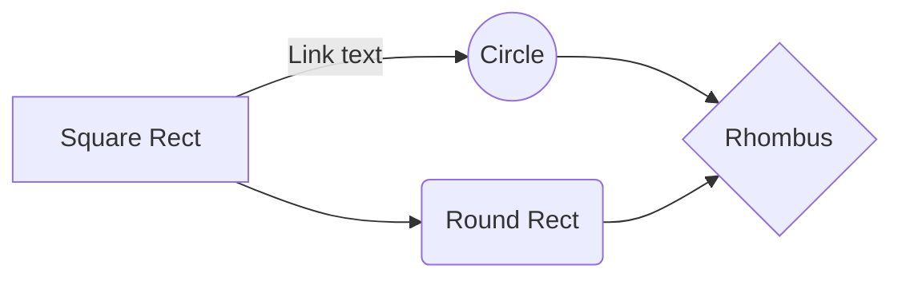
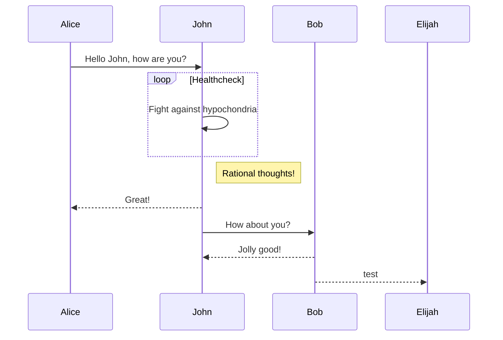

```mermaid
graph LR
A[Square Rect] -- Link text --> B((Circle))
A --> C(Round Rect)
B --> D{Rhombus}
C --> D
```

```mermaid
sequenceDiagram
Alice->>John: Hello John, how are you?
loop Healthcheck
    John->>John: Fight against hypochondria
end
Note right of John: Rational thoughts!
John-->>Alice: Great!
John->>Bob: How about you?
Bob-->>John: Jolly good!
Bob-->>Elijah: test
```
